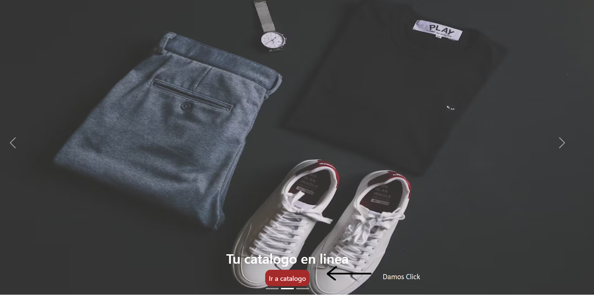
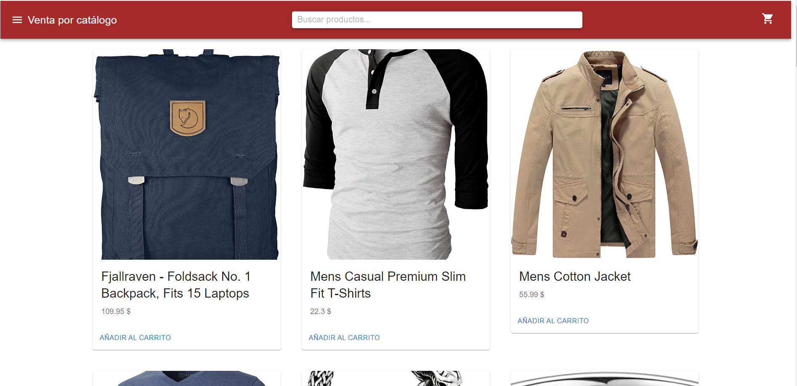
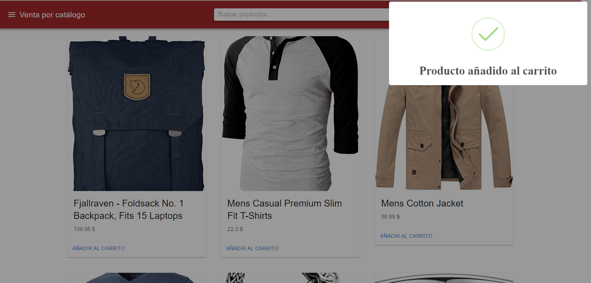
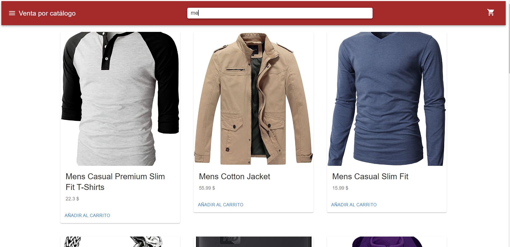
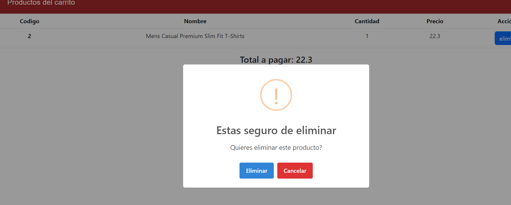

This is a starter template for [Learn Next.js](https://nextjs.org/learn).

bibliotecas utilizadas
- react-query

    npm install react-query
- Material-ui

    npm install @mui/material @emotion/react @emotion/styled
- Boostrap

    npm install bootstrap

- sweetalert2

    npm install sweetalert2

### clonación del proyecto desde github

- 1. Ingresar al cmd de su ordenador (win+r y escribimos cmd y precionamos enter ), navegar hacia la carpeta donde desea clonar el proyecto
- 2. Al encontrarse en el directorio debemos escribir en el siguiente comando: git clone https://github.com/ByronGodoyTenesaca/pruebaTecnicaCatalogo.git
- 3. Al presionar enter notaremos que se está descargando los archivos desde el repositorio, al tener finalizado navegamos hacia la carpeta donde se descargó el repositorio
- 4. Al estar dentro de la carpeta lo primero que necesitamos es instalar las dependencias que necesita el proyecto para funcionar, ingresando el comando **npm install** nos descargara todas las dependencias necesarias de forma automática.
- 5. Cuando tengamos todas las dependencias descargadas ingresamos el comando **npm run dev** para correr la aplicación 

- Formas de Uso

    La página principal mantiene un slader donde se tiene tres imágenes obtenidas de internet y las cuales va cambiando cada 2 segundos para ingresar, únicamente debemos dar click en el botón ir al catálogo en donde a continuación nos mostrara todos los productos

    

    Al presionar el botón ir al catálogo nos enlistará los productos  
    

    Como podemos observar contamos con un botón que nos indica añadir al carrito y si lo presionamos los datos serán añadidos para su posterior compra, de la misma forma al presionar el añadir carrito nos mostrara un modal donde nos indica que el producto fue añadido al carrito y si seguimos añadiendo un mismo producto al carrito nos incrementa la cantidad de productos que desea el usuario  
    

    También cuenta con un menú en donde podemos observar la categorías que se tiene dentro de todos los productos y se puede ir navegando entre ellas
    

    Al igual que podemos separar los productos por categorías, también tenemos la opción de buscar los productos con toda la palabra o solo con las iniciales del nombre de cada producto
    

    En la opción de carrito podemos observar los productos al igual que el precio total que se tiene que cancelar, tambien cuenta con un botón de eliminar si es que el usuario quisiera eliminar el producto al igual antes de eliminar nos salta una advertencia para confirmar si deseamos eliminar o no el producto, si es así nos realizará el cálculo automático sin el producto, también el carrito posee un botón cuál simula la compra y nos envía a la ventana principal
    
