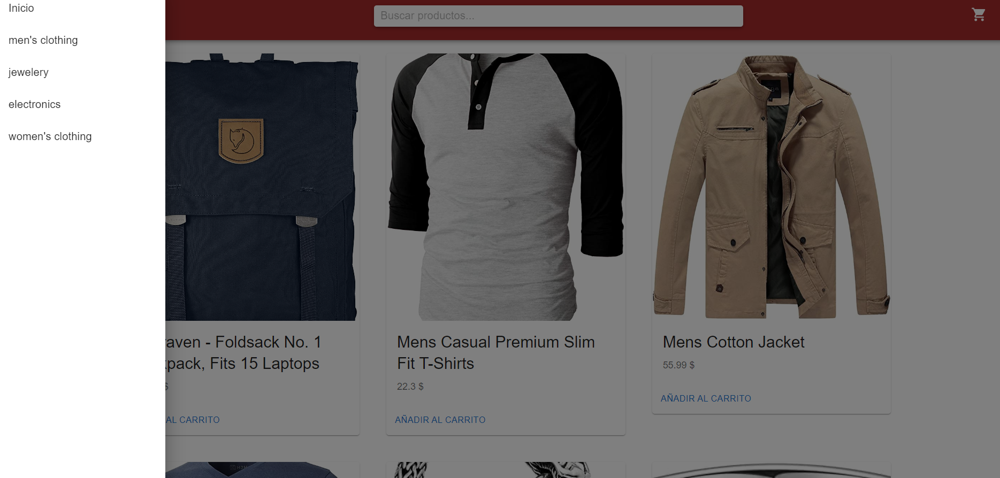

This is a starter template for [Learn Next.js](https://nextjs.org/learn).

bibliotecas utilizadas
- react-query

    npm install react-query
- Material-ui

    npm install @mui/material @emotion/react @emotion/styled
- Boostrap

    npm install bootstrap

- sweetalert2

    npm install sweetalert2

### clonacion del proyecto desde github

- 1. Ingresar al cmd de su ordenador (win+r y escribimos cmd y precionamos enter ), navegar hacia la carpeta donde desea clonar el proyecto
- 2. Al encotrarse en el directorio debemos escribir en el siguiente comando: git clone https://github.com/ByronGodoyTenesaca/pruebaTecnicaCatalogo.git
- 3. Al precionar enter notaremos que se esta descargando los archivos desde el repositorio, al tener finalizado navegamos hacia la carpeta donde se descargo el repositorio
- 4. Al estar dentro de la carpeta lo primero que necesitamos es instalar las dependencias que necesita el proyecto para funcionar, ingresando el comando **npm install** nos descargara todas las dependencias necesaria de forma automatica.
- 5. Cuando tengamos todas las dependencias descargadas ingresamos el comando **npm run dev** para correr la aplicación 

- Formas de Uso

    la pagina principal mantiene un slader donde se tiene tres imagenes obtenidas de internet y las cuales va cambiando cada 2 segundos para ingresar unicamente debemos dar click en el boton ir al catalogo en donde a continuacion nos mostrara todos los productos

    

    Al precionar el boton ir al catalogo nos enlistara los productos 
    

    como podemos observar contamos con un boton que nos indica añadir al carrito y si lo precionamos los datos seran añadidos para su posterior compra, de la misma forma al precionar el añadir carrito nos mostrara un modal donde nos indica que el producto fue añadido al carrito
    

    tambien cuenta con un menu en donde podemos observar la categorias que se tiene dentro de todos los productos y se puede ir navegando entre ellas
    

    al igual que podemos separar los productos por categorias, tambien tenemos la opcion de buscar los productos con toda la palabra o solo con las iniciales del nombre de cada producto
    

    en la opcion de carrito podemos observar los productos al igual que el precio total que se tiene que cancelar, tambien cuenta cin un boton de elimianar si esque el usuario quisiera eliminar el producto al igual antes de eliminar nos salta una advertencia para confirmar si deseamos eliminar o no el producto, si es asi nos realizara el calculo automatico sin el producto, tambien el carrito posee un boton cual simula la compra y nos envia a la ventana principal
    